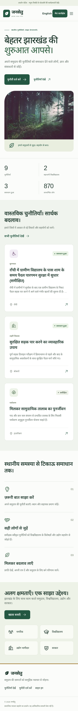
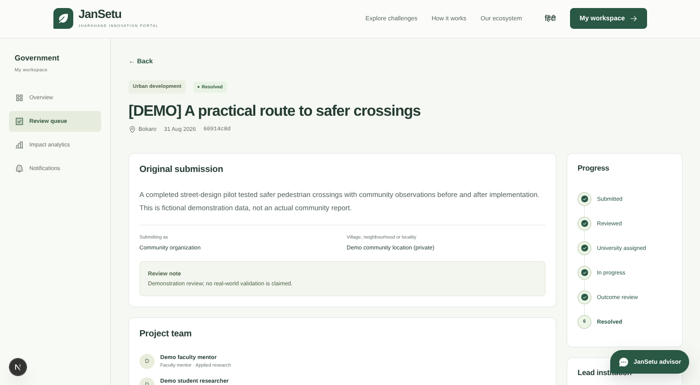
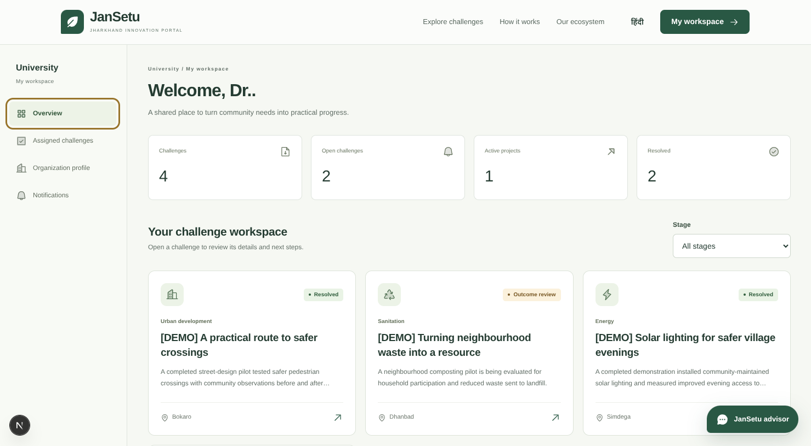
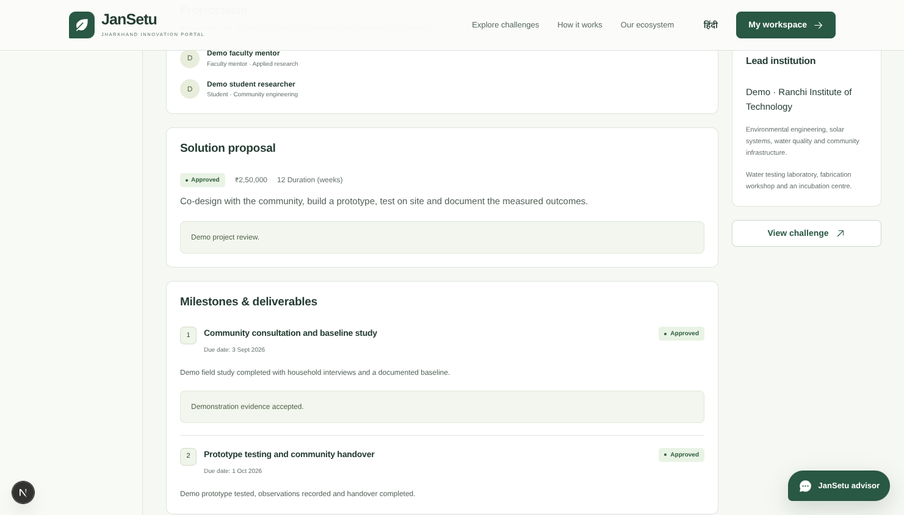
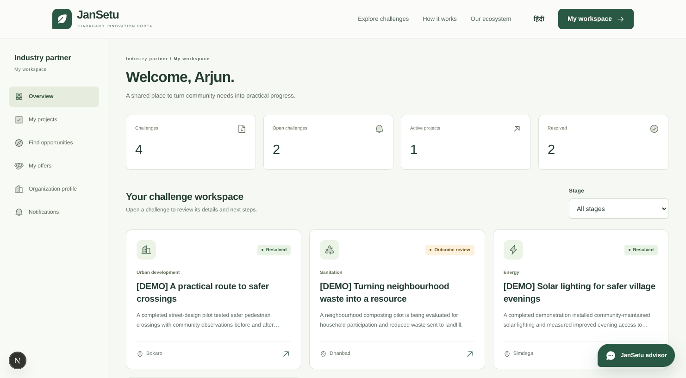
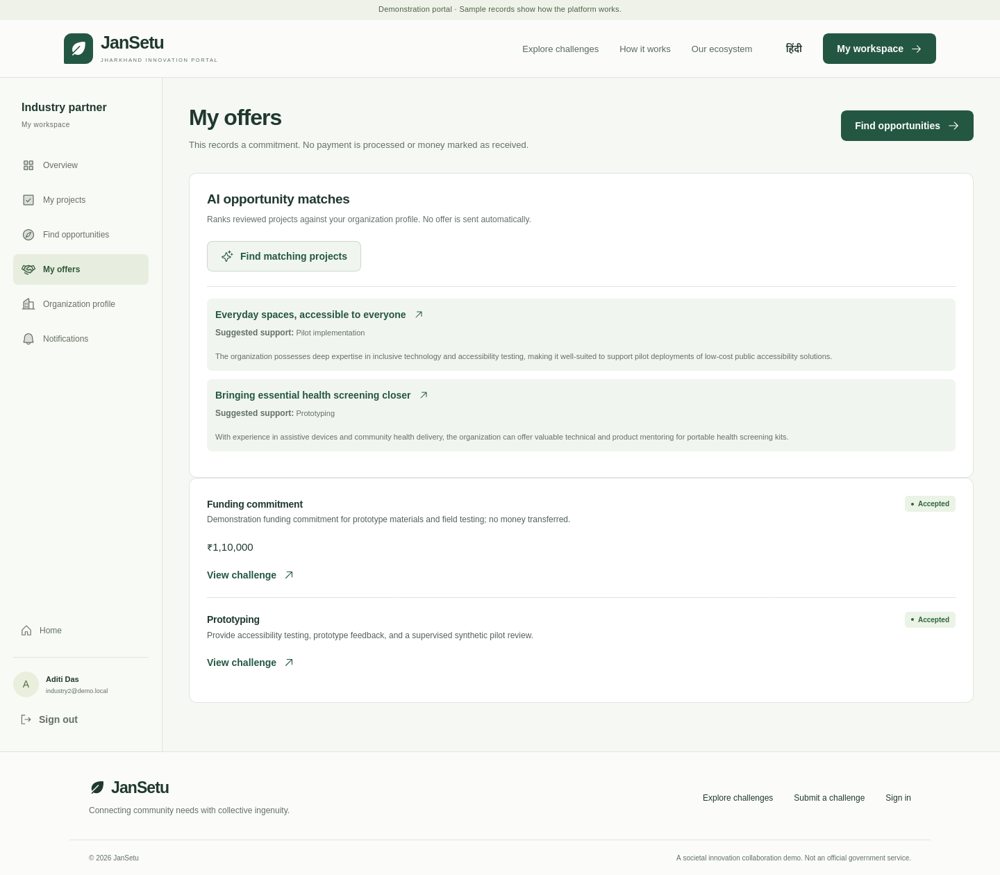
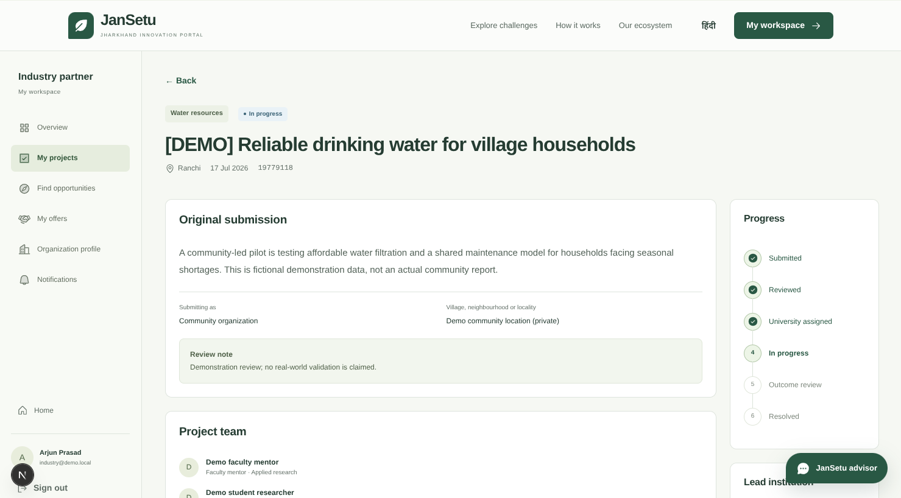
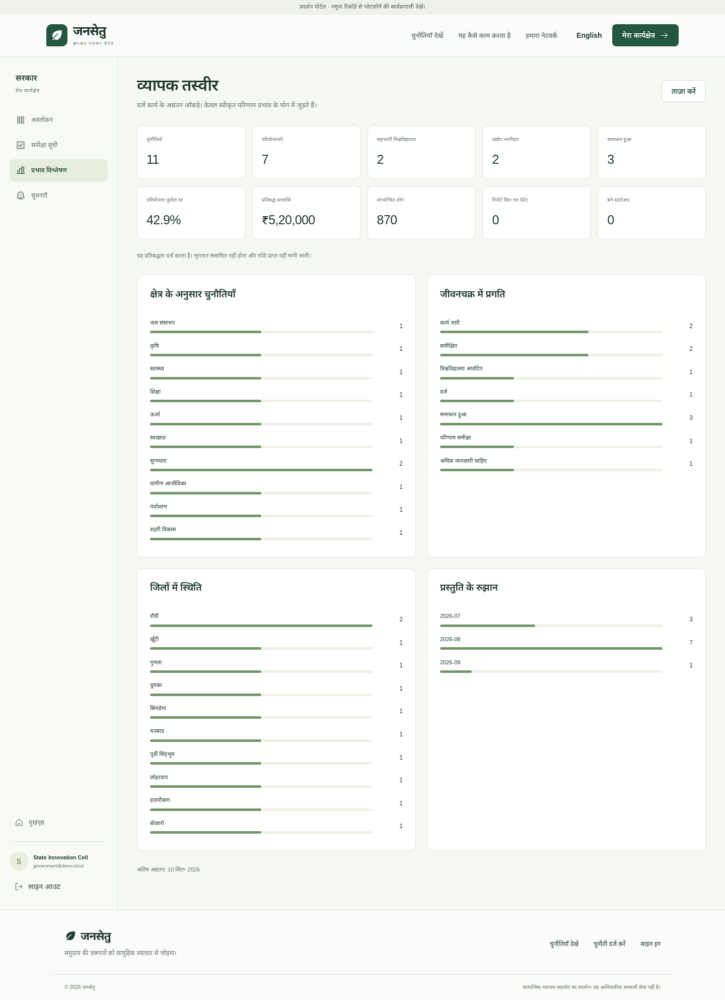

# JanSetu · Jharkhand Innovation Portal

A working English/Hindi societal innovation MVP using Next.js, FastAPI, custom session authentication, and PostgreSQL. Citizens submit challenges; government reviewers validate and allocate them; universities manage teams and delivery; industry partners offer support. Public pages expose reviewed summaries and approved impact totals.

All seeded institutions, people, project records, and outcomes are demonstration data. This is not an official government service.

## Project information

| Field | Value |
|---|---|
| Problem Statement ID | **26043** |
| Problem Statement Title | A digital platform to crowdsource societal challenges and facilitate collaborative problem solving through universities and industry partnerships |
| Organization | Government of Jharkhand |
| Department | Department of Higher & Technical Education |
| Category | Software |
| Theme | Smart Education |
| Project Title | JanSetu — Jharkhand Societal Innovation Portal |
| Live prototype | https://jansetu-jharkhand.vercel.app |

## Team

| Field | Value |
|---|---|
| Team ID | `<REGISTERED_TEAM_ID>` |
| Team Name | **BilluSena** |

| Member | Role |
|---|---|
| Gautam Bajaj | Full-stack developer |
| Gautam Kumar Dipanshu | Full-stack developer |
| Lakshay | Backend developer |
| Monis | Frontend developer |
| Vaishnavi | Frontend developer |
| Komal | Research and design |

Copy the Team ID exactly from the SIH portal before submitting.

## How JanSetu addresses the problem statement

Each expected-solution component from PS 26043, and where it is implemented:

| Required component | Status | Implementation |
|---|---|---|
| Citizen engagement module with multimedia evidence, location and supporting information | Built | Bilingual submission with district, locality, optional GPS, and up to five JPEG/PNG/PDF/MP4 attachments of 20 MB each, validated by extension, media type, signature and size |
| AI-enabled categorization, prioritization, deduplication and routing | Built | Gemini structured output classifies the domain, explains priority, drafts bilingual public copy, and proposes duplicates and universities from bounded candidate sets. Suggestions are stored apart from decisions; reviewers approve every one |
| University collaboration module: review, multidisciplinary teams, faculty mentors, proposals | Built | Assignment accept/decline, student and faculty members with disciplines, and an approach/budget/duration proposal with a government revision loop |
| Industry partnership module: mentoring, funding, prototyping, pilots, technology transfer | Built | All five support kinds, with project access granted only after the lead university accepts the offer. Funding is a recorded commitment, not a payment |
| Project lifecycle management: milestones, approvals, testing outcomes, IP, implementation status | Built | Milestone evidence with government approval, then a validated outcome carrying beneficiaries, a baseline/result impact measure, testing evidence, and patent and startup counts |
| Visual analytics dashboard across domains, districts, institutions and outcomes | Built | Public and government dashboards covering domain, district, status and monthly distribution, completion rate, committed funding, and approved beneficiary, patent and startup totals |
| Notification and communication system across all stakeholders | Built | In-app notifications and a per-challenge discussion for authorised participants, written in the same transaction as the lifecycle change that triggers them |
| Submission through a web **and mobile** interface | Partial | Responsive web across phone, tablet and desktop. There is no native mobile app; see Move the database to Neon later for deferred scope |

Two design commitments run through all of it. AI never decides: no classification, publication, rejection, deduplication, assignment, partnership, plan, evidence or validation is ever applied without an authorised person approving it. Public pages expose only reviewed titles, summaries, district, domain, stage, lead institution and approved aggregates, never identities, raw reports, exact localities, GPS, attachments or discussions.

## Screenshots

Ordered the way the workflow runs: public entry, government review, university delivery, industry partnership, then the validated result.

| | |
|---|---|
| <br>**01 · Public portal** — Hindi, mobile width. Only approved summaries are shown. | <br>**02 · Government review** — the private report, review note and lifecycle progress. |
| <br>**03 · University workspace** — assigned challenges and delivery status at a glance. | <br>**04 · Proposal and milestones** — approved budget and duration, with reviewed milestone evidence. |
| <br>**05 · Industry workspace** — the partner's view of projects and offers. | <br>**06 · AI opportunity matching** — reviewed projects ranked against the organization profile. No offer is sent automatically. |
| <br>**07 · Partner project access** — granted only after the lead university accepts the offer. | <br>**09 · Analytics** — domain, district and lifecycle distribution with approved impact totals. |

**08 · [Full resolved lifecycle, in Hindi](assets/screenshots/08-resolved-challenge-lifecycle-hindi.png)** — one long capture of a completed challenge: original report, team, approved proposal, milestone evidence, industry support, the validated outcome (120 beneficiaries, 8 → 31), attachments, discussion and the complete activity log.

Further browser evidence covering all four roles, both languages and the AI
fallback paths is in [artifacts/playwright/REPORT.md](artifacts/playwright/REPORT.md).

## Submission

- Presentation: [submission/PRESENTATION.md](submission/PRESENTATION.md)
- Demo video: [submission/DEMO.md](submission/DEMO.md)
- Deployment design: [DEPLOYMENT_PLAN.md](DEPLOYMENT_PLAN.md)

## Run locally

Requirements: Node.js 22+, Python 3.12, [uv](https://docs.astral.sh/uv/), and Docker with Compose.

From the project root:

```sh
docker compose up -d --wait db
```

Set up and start the API in one terminal:

```sh
cd backend
cp .env.example .env
uv sync
uv run alembic upgrade head
uv run python -m app.seed
uv run uvicorn app.main:app --reload --host 127.0.0.1 --port 8000
```

Start the frontend in a second terminal:

```sh
cd frontend
cp .env.example .env.local
npm ci
npm run dev
```

Open **http://localhost:3000**. Use that hostname consistently: `APP_ORIGIN` must exactly match the browser origin for state-changing requests. PostgreSQL is bound to `127.0.0.1:54329`; its data lives in the Compose named volume. Stop it with `docker compose stop db` to retain records.

The API is at `http://127.0.0.1:8000/api/v1`; interactive endpoint documentation is at `http://127.0.0.1:8000/docs`. The frontend proxies `/api/*` to FastAPI. Health checks are available at `/api/v1/health` on either server.

## Demo accounts

Default password for all seeded accounts: **`DemoPass123!`**. The login screen's role buttons fill these credentials; they do not bypass authentication. `DEMO_PASSWORD` can override the password before the first seed; then enter the replacement password manually.

| Role | Email | Organization |
|---|---|---|
| Citizen | `citizen@demo.local` | Community submitter |
| Government | `government@demo.local` | State Innovation Cell |
| University | `university@demo.local` | Demo · Ranchi Institute of Technology |
| Industry | `industry@demo.local` | Demo · GreenGrid Industries |
| University | `university2@demo.local` | Demo · Birsa Rural Innovation Centre |
| University | `university3@demo.local` | Demo · Santhal Community University |
| Industry | `industry2@demo.local` | Demo · Adiva Social Ventures |

The seed command is explicit and idempotent. It never resets existing records or runs automatically at startup. Citizens can also register with an email, name, and password of at least ten characters. Institution and government registration, email verification, and password recovery are outside this local MVP.

## Walk through the lifecycle

1. **Citizen:** create a challenge with a title, description, submitter type, district, and locality. GPS is optional. Add evidence during submission or afterward. The report is saved before uploads and AI analysis; upload failures can be retried without creating another report.
2. **Government:** open the review queue. Inspect the private report and AI suggestions if configured. Approve safe public titles and summaries in both languages, choose a domain and priority, then assign a university. Alternatively request information, reject with an explanation, or link a duplicate to an existing challenge.
3. **University:** accept the assignment to create the project, or decline to return it to the allocation queue. Add a student and a faculty mentor, including their disciplines. Submit an approach, budget, and duration.
4. **Government:** approve the proposal or request revisions. Approval starts the project.
5. **Industry:** browse the public challenge, then offer mentorship, funding, prototyping, a pilot, or technology transfer. Funding records commitments in INR; there is no payment processing or claim that money was received.
6. **University:** accept an industry offer to grant project access, or decline it. Add milestones and submit testing evidence for each. **Government** approves the evidence or requests revisions.
7. **University:** once every milestone is approved, submit beneficiaries, an impact measure with unit and baseline/result, testing evidence, and any patent/startup references. **Government** validates the outcome to resolve the challenge, or requests changes.
8. **Citizen:** add optional community feedback. Use the project discussion throughout the process. Check notifications and government analytics to see recorded events and aggregate outcomes.

The seeded examples cover intake, requests for information, allocation, proposals, active projects, outcome review, and completion. The language switch works on public pages and all workspaces; user-entered reports and organization profiles retain their original language.

## AI configuration

For local Vertex AI access, place Application Default Credentials at `application_default_credentials.json` in the project root and keep the file private (`chmod 600 application_default_credentials.json`). The filename is ignored by Git. The backend uses ADC first, with `GEMINI_API_KEY` from `backend/.env` as a fallback. `GOOGLE_CLOUD_LOCATION` defaults to `global`; `GEMINI_MODEL` defaults to `gemini-3.8-flash`.

The Google GenAI integration uses structured, Pydantic-validated output for classification, priority reasons, English/Hindi publication drafts, duplicate suggestions, and university recommendations. It also provides optional citizen writing guidance, university project-plan drafts, industry opportunity matching, and government outcome-evidence checks. Suggestions are stored separately from approved decisions. Returned IDs must belong to the supplied candidate set. Only government reviewers can read stored challenge and outcome suggestions.

The floating JanSetu Advisor answers portal and workflow questions in English or Hindi. Public visitors receive curated guidance; signed-in users receive role-aware Gemini guidance with curated fallback. It performs no portal actions, sends no database record context to Gemini, and keeps at most 12 messages in browser `sessionStorage` for the current tab.

Run a live smoke check with synthetic data:

```sh
cd backend
uv run python -m app.ai_smoke
```

Without valid credentials, or when the provider fails or returns invalid output, the UI clearly offers manual work. Transient provider failures are retried up to three times. No classification, publication, rejection, deduplication, assignment, partnership, project plan, evidence, or validation decision is silently faked. A crashed challenge analysis becomes eligible for retry after two minutes.

The demo analyzes at most 40 recent challenges, prioritizing the same district, 50 university profiles, and 30 active industry opportunities. These are bounded shortlists, not exhaustive semantic search. Add semantic retrieval when directory size or matching recall requires it. The provider receives only the text needed for each explicit task; it never receives uploaded files, login credentials, GPS coordinates, exact localities, names, or discussion messages.

## Access, evidence, and consistency

- Passwords are hashed with Argon2. Random session tokens are stored as SHA-256 hashes, expire after seven days, and are revoked on logout. Cookies are HttpOnly and SameSite=Lax, with Secure enabled for HTTPS origins. Tokens are not stored in browser storage.
- All mutations require the configured Origin. Authentication attempts are persisted and serialized with PostgreSQL advisory locks: 15 attempts per normalized email and 60 per API peer IP in 15 minutes. The local Next.js proxy shares the IP bucket; configure trusted proxy addressing before a public rollout.
- Citizen registration always creates a citizen. Every private challenge, project action, organization edit, notification update, and evidence download checks role and ownership or accepted participation in FastAPI.
- Public response models contain only reviewed titles/summaries, district, domain, stage, lead institution, project reference, and approved aggregate outcomes. Private locations, raw reports, identities, comments, attachments, and unapproved AI drafts are excluded.
- Evidence allows five files per challenge, each up to 20 MB: JPEG, PNG, PDF, and MP4. The server checks extension, declared media type, signature, and size; generates storage names; and serves authorized downloads as attachments. Failed writes are removed. Uploaded files live under `backend/.data/uploads`, outside public assets.
- Lifecycle changes lock the challenge row; changes, activity history, and notifications commit together before the response. Duplicate assignment, proposal, offer, and approval actions are rejected. An industry offer confers project access only after university acceptance.
- Discussions, notification lists, project details, and analytics refresh every 30 seconds while their page is visible. Local React state handles forms; there is no separate realtime server or queue.

## Checks and production build

```sh
cd backend
uv run python -m unittest discover -s tests -v
uv run alembic check
uv run python -m compileall -q app
```

The integration checks create and drop randomly named PostgreSQL schemas using the configured database. They require permission to create schemas, use mocked AI responses, and do not modify demo records. Use the local database for these checks.

```sh
cd frontend
npm run typecheck
npm run build
npm start
```

Stop the development frontend before `npm start`, since both use port 3000. Production builds use Next.js's supported Webpack compiler for compatibility with restricted development environments. The committed lockfiles reproduce the tested dependencies.

Validation covers the full workflow, revision branches, duplicate actions, role escalation, cross-organization access, private/public separation, session expiry and logout, authentication throttling, file type/size/count restrictions, notifications, and invalid or unavailable AI output. Browser verification covers all four roles, public filters and empty states, English/Hindi, and responsive layouts. A real Gemini call requires a configured key; the local demo works without one.

## Move the database to Neon later

1. Create a Neon database and obtain its direct PostgreSQL connection string.
2. Set `DATABASE_URL` in the API environment, using the `postgresql+psycopg://` driver prefix and retaining `sslmode=require`. Keep passwords out of source control.
3. Run `uv run alembic upgrade head` against the new database. This creates the schema; it does not copy existing local data. Transfer data separately with standard PostgreSQL backup/restore tooling if needed.
4. Point the frontend's `BACKEND_URL` at the deployed FastAPI service, set `APP_ORIGIN` to the public HTTPS frontend origin, and rebuild/restart the services.

Neon hosts the database, not the API or evidence files. Preserve the API upload directory on durable storage or add private object storage before deploying to an ephemeral filesystem. Public deployment, messaging delivery, native apps, payment processing, and account recovery are deferred.

## Assets

The local forest hero photograph comes from [Unsplash](https://images.unsplash.com/photo-1448375240586-882707db888b). It illustrates a green landscape and is not presented as a verified photograph of a Jharkhand project. Icons use Phosphor. No external image request is needed to render the portal.
