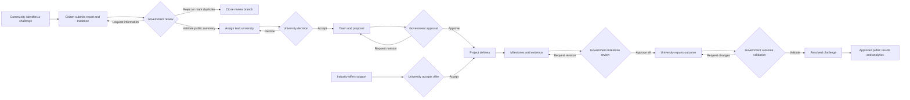
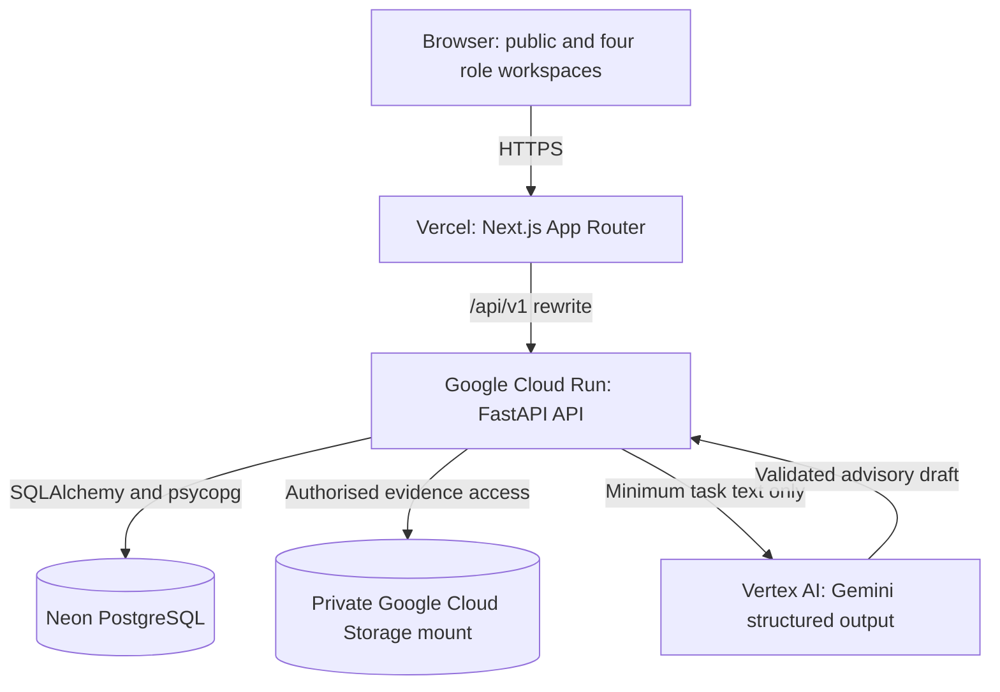
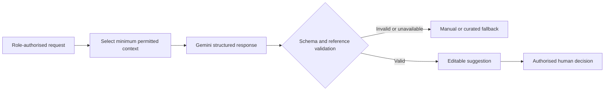

# JanSetu System Architecture

JanSetu connects community challenges with government review, university delivery,
industry support, and validated public outcomes. The current deployment is a
responsive English/Hindi web application.

## Challenge lifecycle

Every state-changing decision is made by an authorised person. Gemini can draft,
classify, rank, and identify evidence gaps, but it cannot publish, assign, approve,
reject, or validate a record.

## Deployed system

The browser uses only the `/api/v1` boundary. Next.js forwards those requests to
FastAPI, where authentication, access control, lifecycle rules, database writes,
file authorization, and AI response validation are enforced.

## AI advisory flow

Challenge analysis may store suggestions separately from approved decisions.
Other assistants return editable drafts. Gemini never receives credentials,
uploaded evidence, GPS coordinates, exact localities, identities, or discussion
messages.

## Trust and data boundaries

| Boundary | Enforcement |
|---|---|
| Authentication | Argon2 password hashes and random database-backed sessions in HttpOnly, SameSite=Lax cookies |
| Mutations | Configured Origin check plus role and record-ownership authorization in FastAPI |
| Private reports | Original descriptions, exact locality, GPS, evidence, identities, and discussions remain participant-only |
| Public records | Separate response models expose approved bilingual summaries, district, domain, progress, lead institution, and validated aggregates |
| Evidence | Type, signature, size, and count validation; generated private storage names; authorised downloads only |
| Lifecycle | Row locking keeps state transitions, activity history, and notifications transactional |

## Source layout

- `frontend/` — Next.js, TypeScript, React, and Tailwind CSS.
- `backend/` — FastAPI, SQLAlchemy, Alembic, PostgreSQL, authentication, and AI integration.
- `compose.yaml` — local PostgreSQL service.
- `assets/screenshots/` — reviewer-facing workflow captures.
- `artifacts/` — supporting browser-audit and presentation-generation evidence.
- `submission/` — final PPTX/PDF and demo links.

